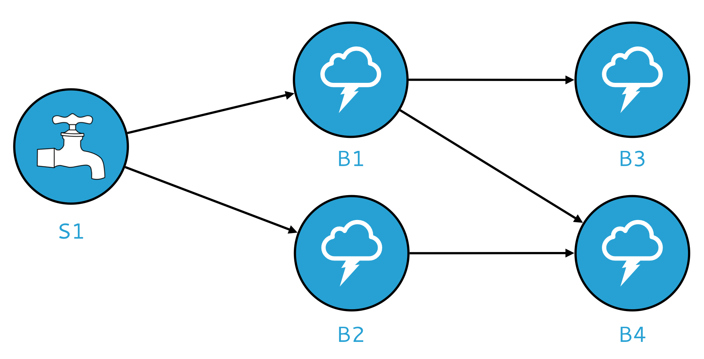

# Heron Topologies

A Heron **topology** is a directed [acyclic
graph](https://en.wikipedia.org/wiki/Directed_acyclic_graph) used to process
streams of data. Heron topologies consist of three basic components:
[spouts](#spouts) and [bolts](#bolts), which are connected via
**streams** of [tuples](../developers/java/data-model.html).

Spouts are responsible for emitting [tuples](../developers/java/data-model.html)
into the topology, while bolts are responsible for processing those tuples. In
the diagram above, spout **S1** feeds tuples to bolts **B1** and **B2** for
processing; in turn, bolt **B1** feeds processed tuples to bolts **B3** and
**B4**, while bolt **B2** feeds processed tuples to bolt **B4**.

This is just a simple example; you can use bolts and spouts to form arbitrarily
complex topologies.

## Topology Lifecycle

Once you've set up a [Heron cluster](../operators/deployment/index.html), you
can use Heron's [CLI tool](../operators/heron-cli.html) to manage the entire
lifecycle of a topology, which typically goes through the following stages:

1. You [submit](../operators/heron-cli.html#submitting-a-topology) the topology
   to the cluster. The topology is not yet processing streams but is ready to be
   activated.
2. You [activate](../operators/heron-cli.html#activating-a-topology) the
   topology. Now the topology will begin processing streams in accordance with
   the topology architecture that you've created.
3. You can [restart](../operators/heron-cli.html#restarting-a-topology) an
   active topology if, for example, you need to apply a changed configuration to
   the topology.
4. You can [deactivate](../operators/heron-cli.html#deactivating-a-topology) the
   topology at any time. Once deactivated, the topology will stop processing but
   remain submitted in the cluster.
5. If you [kill](../operators/heron-cli.html#killing-a-topology) a topology it
   is no longer known to your Heron cluster and can no longer be activated. Once
   killed, the only way to use that topology in your cluster is to re-submit it.

## Spouts

A Heron **spout** is a source of streams, responsible for emitting
[tuples](../developers/java/data-model.html) into the topology. A spout may, for
example, read data from a Kestrel queue or read tweets from the Twitter API and
emit tuples to one or more bolts.

Information on building spouts can be found in [Building
Spouts](../developers/java/spouts.html).

## Bolts

A Heron **bolt** consumes streams of
[tuples](../developers/java/data-model.html) emitted by spouts and performs some
set of user-defined processing operations on those tuples, which may include
performing complex stream transformations, performing storage operations,
aggregating multiple streams into one, emitting tuples to other bolts within the
topology, and much more.

Information on building bolts can be found in [Building
Bolts](../developers/java/bolts.html).

## Data Model

Heron has a fundamentally tuple-driven data model. You can find more information
in [Heron's Data Model](../developers/java/data-model.html).

## Logical Plan

A topology's **logical plan**

## Physical Plan

A topology's **physical plan**
